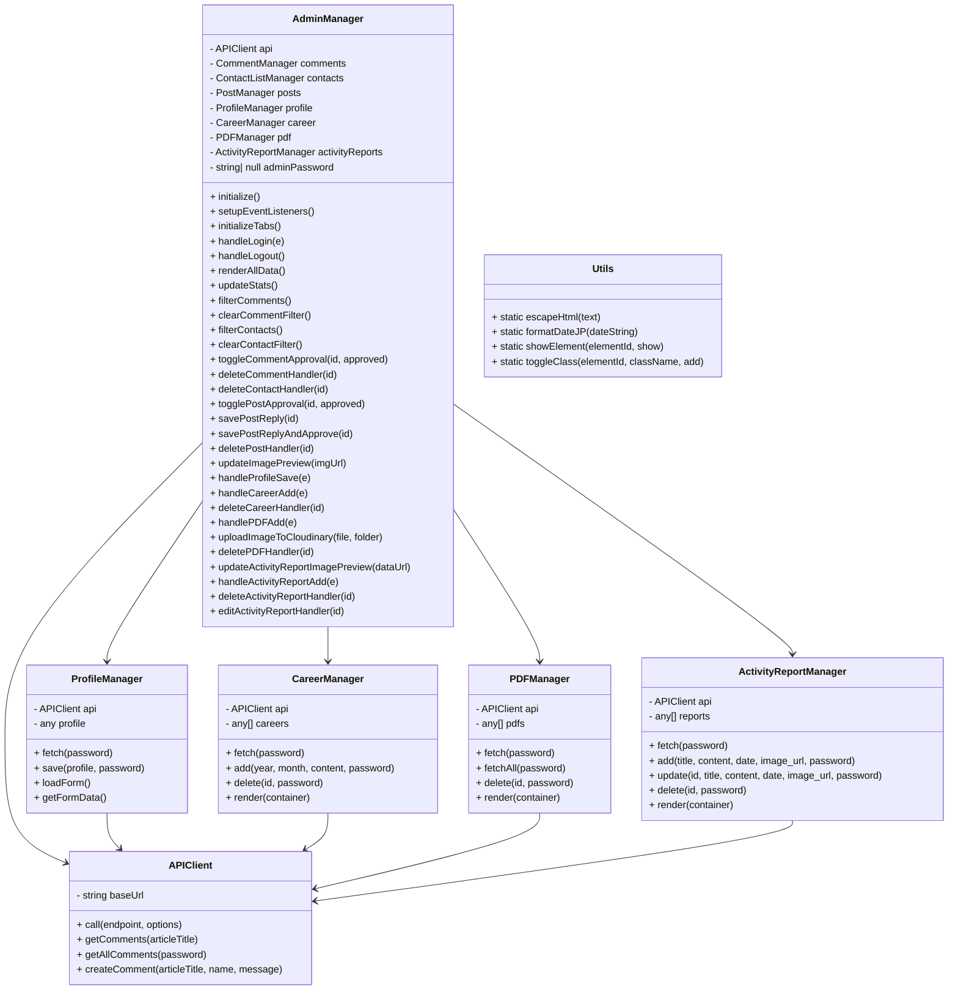

# 管理システム クラス詳細図

```mermaid
classDiagram
    class AdminManager {
        - APIClient api
        - CommentManager comments
        - ContactListManager contacts
        - PostManager posts
        - ProfileManager profile
        - CareerManager career
        - PDFManager pdf
        - ActivityReportManager activityReports
        - string| null adminPassword
        + initialize()
        + setupEventListeners()
        + initializeTabs()
        + handleLogin(e)
        + handleLogout()
        + renderAllData()
        + updateStats()
        + filterComments()
        + clearCommentFilter()
        + filterContacts()
        + clearContactFilter()
        + toggleCommentApproval(id, approved)
        + deleteCommentHandler(id)
        + deleteContactHandler(id)
        + togglePostApproval(id, approved)
        + savePostReply(id)
        + savePostReplyAndApprove(id)
        + deletePostHandler(id)
        + updateImagePreview(imgUrl)
        + handleProfileSave(e)
        + handleCareerAdd(e)
        + deleteCareerHandler(id)
        + handlePDFAdd(e)
        + uploadImageToCloudinary(file, folder)
        + deletePDFHandler(id)
        + updateActivityReportImagePreview(dataUrl)
        + handleActivityReportAdd(e)
        + deleteActivityReportHandler(id)
        + editActivityReportHandler(id)
    }
    class ProfileManager {
        - APIClient api
        - any profile
        + fetch(password)
        + save(profile, password)
        + loadForm()
        + getFormData()
    }
    class CareerManager {
        - APIClient api
        - any[] careers
        + fetch(password)
        + add(year, month, content, password)
        + delete(id, password)
        + render(container)
    }
    class PDFManager {
        - APIClient api
        - any[] pdfs
        + fetch(password)
        + fetchAll(password)
        + delete(id, password)
        + render(container)
    }
    class ActivityReportManager {
        - APIClient api
        - any[] reports
        + fetch(password)
        + add(title, content, date, image_url, password)
        + update(id, title, content, date, image_url, password)
        + delete(id, password)
        + render(container)
    }
    class APIClient {
        - string baseUrl
        + call(endpoint, options)
        + getComments(articleTitle)
        + getAllComments(password)
        + createComment(articleTitle, name, message)
    }
    class Utils {
        + static escapeHtml(text)
        + static formatDateJP(dateString)
        + static showElement(elementId, show)
        + static toggleClass(elementId, className, add)
    }
    AdminManager --> ProfileManager
    AdminManager --> CareerManager
    AdminManager --> PDFManager
    AdminManager --> ActivityReportManager
    AdminManager --> APIClient
    ProfileManager --> APIClient
    CareerManager --> APIClient
    PDFManager --> APIClient
    ActivityReportManager --> APIClient
```

---

このファイルは2026年2月20日時点の管理システムのクラス構成を示しています。
